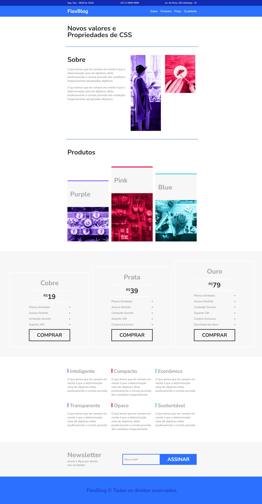

<h1 align= "center">FlexBlog</h1>

## ✅Sobre:
<p>O projeto uma criação de um site com uma única página: FlexBlog. Com ele vamos conseguir experimentar praticamente todas as propriedades do Flexbox.</p>

<br><br>

```bash
#Clone the project
$ git clone https://github.com/LairaCastro/Flexblog.git
```
